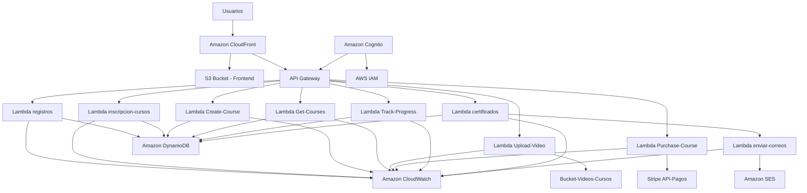

## Problema

Una plataforma de cursos virtuales presentaba fallos críticos en el proceso de emisión de certificados al finalizar los cursos. Durante periodos de alta demanda, el sistema experimentaba demoras significativas, errores intermitentes y saturación en los servicios encargados del almacenamiento y generación de certificados. Esta inestabilidad impactaba negativamente en la experiencia de los usuarios, generaba dudas sobre la confiabilidad del sistema y dificultaba la capacidad de escalar eficientemente ante el crecimiento de la base estudiantil.

## Descripción Técnica de la Infraestructura en AWS

Esta infraestructura, desplegada mediante Terraform, implementa un sistema completo de gestión de cursos virtuales que incluye registro de usuarios, creación y gestión de cursos, procesamiento de pagos, seguimiento de progreso y emisión de certificados. La arquitectura utiliza servicios serverless de AWS organizados en módulos funcionales que integran **API Gateway**, **AWS Lambda**, **DynamoDB**, **SQS**, **SES**, **CloudFront**, **S3** y **Stripe**, con seguridad habilitada mediante **IAM** y **AWS Cognito**.

---

### 1. Autenticación y Autorización

**Amazon Cognito** se utiliza como servicio de autenticación principal:
- Gestiona el registro y autenticación de usuarios
- Integrado con **AWS Identity and Access Management (IAM)** para control de acceso granular
- Proporciona tokens JWT para autorizar llamadas a la API

---

### 2. Distribución de Contenido y Frontend

**Amazon CloudFront** actúa como CDN y punto de entrada principal:
- Distribuye contenido estático desde **S3 Bucket** (frontend de la aplicación)
- Enruta llamadas API hacia **API Gateway** mediante path `/api/*`
- Proporciona certificado SSL/TLS para conexiones seguras
- Optimiza la entrega de contenido globalmente

**S3 Bucket** almacena:
- Aplicación web estática (HTML, CSS, JavaScript)
- Videos de cursos en bucket dedicado (`Bucket-Videos-Cursos`)
- Archivos y recursos educativos

---

### 3. API Gateway

**Amazon API Gateway** expone múltiples endpoints REST organizados por funcionalidad:

**Endpoints de Usuario:**
- `POST /registros` - Registro de nuevos usuarios
- Integración con Amazon Cognito para autenticación

**Endpoints de Cursos:**
- `POST /inscripcion-cursos` - Inscripción a cursos
- `GET /cursos` - Obtención de lista de cursos disponibles
- `POST /upload-video` - Subida de videos de curso

**Endpoints de Pagos:**
- `POST /purchase-course` - Procesamiento de compras
- Integración con Stripe para pagos

**Endpoints de Progreso y Certificación:**
- `POST /track-progress` - Seguimiento de progreso del estudiante
- `POST /certificados` - Generación de certificados

Todos los endpoints están desplegados en el **stage `prod`** con permisos explícitos para invocar las funciones Lambda correspondientes.

---

### 4. Funciones Lambda

La arquitectura incluye múltiples funciones Lambda especializadas:

**Gestión de Usuarios:**
- **registros**: Maneja el registro de usuarios y almacena datos en DynamoDB
- Integrada con Cognito para creación de cuentas

**Gestión de Cursos:**
- **inscripcion-cursos**: Procesa inscripciones de estudiantes a cursos
- **create-course**: Permite la creación de nuevos cursos
- **get-courses**: Recupera información de cursos disponibles
- **upload-video**: Gestiona la subida de contenido multimedia a S3

**Procesamiento de Pagos:**
- **purchase-course**: Integrada con Stripe API para procesar pagos
- Valida transacciones y actualiza estado de inscripciones

**Seguimiento y Certificación:**
- **track-progress**: Monitorea el avance de estudiantes en cursos
- **certificados**: Genera certificados al completar cursos
- **enviar-correos**: Procesa cola SQS para envío de notificaciones

Todas las funciones utilizan **Node.js 16.x** como runtime y tienen roles IAM específicos con permisos mínimos necesarios.

---

### 5. Base de Datos (DynamoDB)

**Amazon DynamoDB** proporciona almacenamiento NoSQL con múltiples tablas especializadas:

**Tabla Certificates:**
- Clave primaria: `certificateId`
- Índices secundarios globales: `UserIdIndex`, `StatusIndex`
- Almacena información de certificados emitidos

**Tabla Registrations:**
- Clave compuesta: `userId + email`
- Índices para `email` y `accountType`
- Información de usuarios registrados
- Point-in-Time Recovery habilitado

**Tablas adicionales (inferidas del flujo):**
- Tabla de Cursos: Información de cursos disponibles
- Tabla de Inscripciones: Relación usuario-curso
- Tabla de Progreso: Seguimiento de avance por usuario

Características comunes:
- Encriptación con AWS KMS
- TTL habilitado con `expirationDate`
- Auto-scaling configurado para manejar cargas variables

---

### 6. Procesamiento Asíncrono (SQS)

**Amazon SQS** implementa colas para desacoplar procesos:

**Cola `email-queue-certificados`:**
- Recibe mensajes de la Lambda `certificados`
- Procesa envío de notificaciones de manera asíncrona
- Garantiza entrega confiable de correos electrónicos

**Flujo de procesamiento:**
1. Lambda `certificados` genera certificado y envía mensaje a SQS
2. SQS dispara automáticamente la Lambda `enviar-correos`
3. Lambda `enviar-correos` utiliza SES para envío

---

### 7. Servicio de Correo (SES)

**Amazon SES** maneja todas las comunicaciones por correo electrónico:
- Notificaciones de certificados emitidos
- Confirmaciones de inscripción
- Recordatorios y actualizaciones de cursos
- Configurado con dominio verificado para producción

---

### 8. Procesamiento de Pagos

**Stripe** se integra como procesador de pagos externo:
- API de Stripe para transacciones seguras
- Webhooks para confirmación de pagos
- Integración con Lambda `purchase-course` para validación

---

### 9. Seguridad (IAM, Cognito & KMS)

**Amazon Cognito:**
- User Pools para autenticación de usuarios
- Identity Pools para acceso temporal a recursos AWS
- Integración con IAM para autorización

**IAM Roles y Políticas:**
- Cada función Lambda tiene rol específico con permisos mínimos
- Políticas para acceso a DynamoDB, S3, SQS, SES según necesidad
- Roles para usuarios finales mediante Cognito

**AWS KMS:**
- Clave personalizada para encriptación de datos sensibles en DynamoDB
- Encriptación en tránsito y en reposo para todos los servicios

---

### Diagrama de Arquitectura 

